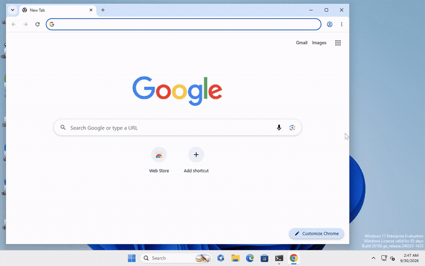
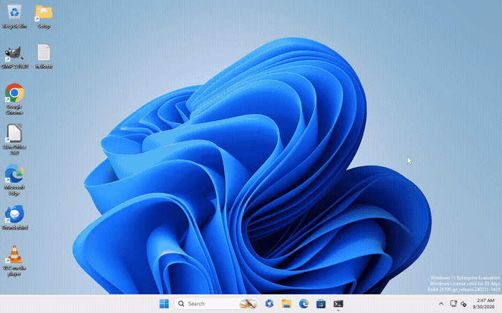
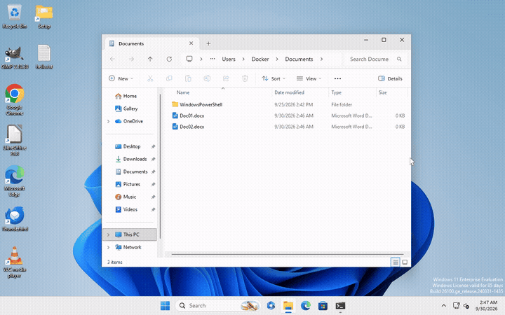
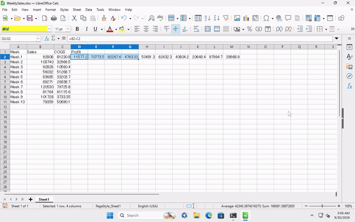
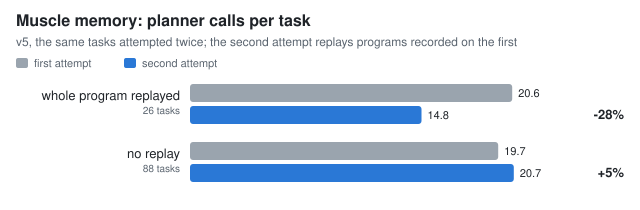
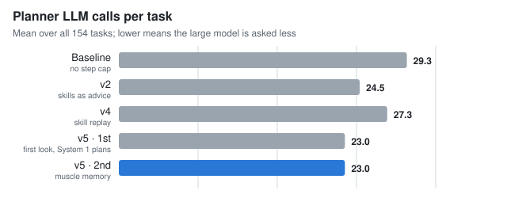
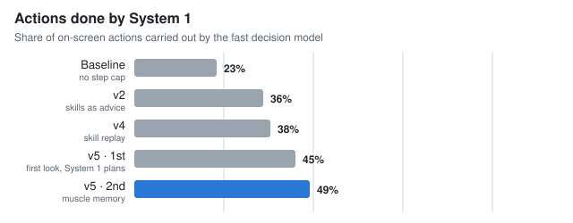
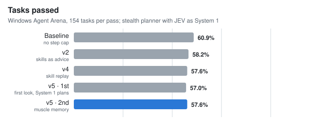

<p align="center">
  
</p>

<h1 align="center">POK-Agent</h1>

<p align="center">
A Windows computer-use agent where a large model plans and a small, fast model acts,<br>
and repeated tasks become muscle memory.
</p>

<p align="center">

[](https://github.com/Acekorneya/POK-Agent/actions/workflows/ci.yml)
[](https://github.com/Acekorneya/POK-Agent/actions/workflows/windows-build.yml)
[](https://github.com/Acekorneya/POK-Agent/releases/latest)
[](LICENSE)


[](https://www.buymeacoffee.com/acekorneyab)

</p>

POK-Agent is an autonomous general computer and coding harness built primarily
for local models, with cloud bring-your-own-model (BYOM) support. The Rust-first
Windows runtime has a shared CLI and Tauri dashboard, typed tools, risk-based
approval, SQLite FTS5 memory, restricted coding subagents, and a deterministic
model exam. Code, crates, and files use the short name `pok-ai` (for example
`pok-ai.toml`), and app data lives under `%LOCALAPPDATA%\POK-Ai`.

## Download

Get the latest Windows build from
[Releases](https://github.com/Acekorneya/POK-Agent/releases/latest):

| File | Use it when |
| --- | --- |
| `POK-Agent-windows-x64-setup.exe` | You want a normal install with a Start menu entry (recommended). |
| `POK-Agent-windows-x64.exe` | You want to run the app without installing it. |
| `POK-Agent-windows-x64.zip` | You want a portable folder with the example configuration. |
| `SHA256SUMS.txt` | You want to verify the downloads. |

The builds are not code-signed yet, so Windows SmartScreen may say "Windows
protected your PC". Choose **More info → Run anyway**. After it starts, open
**Settings → Model** and pick a provider: a local model through
[LM Studio](https://lmstudio.ai) or [Ollama](https://ollama.com), or a cloud
provider with your own API key (stored in Windows Credential Manager). A
System 1 router (JEV or Laya) is optional; the agent works without one. To
build from source instead, see [Quick start](#quick-start).

## Research: System 1 and System 2 for computer use

Most computer-use agents send every click through a large language model. POK-Agent splits the
work the way people do:

- **System 2, the planner** (a large LLM), reads the task, decides what to do, and writes plans
  that can run dozens of steps ahead.
- **System 1, a small fast decision model** (Laya locally, or the hosted JEV), carries those plans
  out on screen. It answers small, well-posed questions (which of these labels to click, whether
  a step is done) with calibrated probabilities, and hands back to the planner whenever it is
  unsure.
- **Grounding** fuses Windows UI Automation and OCR into numbered targets, so most steps are
  checked locally by exact label, with no model at all.
- **Muscle memory.** Every verified run is saved as a *motor program*: the exact clicks, keys,
  and text that worked. The next time the same or a similar task comes up, System 1 replays the
  program and the planner is only needed where the screen differs. Values from the new request
  are filled into the recorded slots; text from a user's request is never stored, only
  fingerprinted.
- **Self-improvement.** Skills gain trust with every verified run and lose it with every failure.
  A replay that no longer fits is replaced by the path that finished the job, a leaner path
  replaces a longer one, and System 1 questions with proven answers and planner hand-backs are
  logged as training data for fine-tuning the local System 1 (from runs with a local System 1;
  hosted JEV's terms do not allow training other models on it).

### See it work

Recorded in clean Windows 11 VMs from Windows Agent Arena, with no human input. The agent was
given only the task sentence. Moments where the screen did not change (the planner thinking)
are cut, so each clip shows the actions only; the real time is given beside it.

**Muscle memory: the same task, first time and again.** Chrome, *"set the default font size to
the largest"*. The first attempt is planned step by step. The second time, System 1 replays the
recorded program and the planner only checks the result.

| First attempt: 9 planner calls, 231 s | With muscle memory: 4 planner calls, 38 s |
| --- | --- |
|  |  |

Settings, *"change my desktop background to a solid color"*. Left: no memory. Right: a program
learned in an earlier arena run, replayed end to end by System 1 (5 of 5 steps).

| No memory: 19 planner calls, 196 s | With muscle memory: 5 planner calls, 51 s |
| --- | --- |
|  |  |

**Folders and spreadsheets.**

| File Explorer: *"create a folder named Archive in Documents and move all .docx files into it"* (20 planner calls, 241 s) | LibreOffice Calc: *"add a Profit column: Sales minus COGS"* (first 40 s of a 639 s run, which the agent spent mostly re-checking its result) |
| --- | --- |
|  |  |

All six runs passed the benchmark's own checker. The clips are made with
`scripts/arena/record_demo.py`, which records the VM screens during an arena run.

### Results on Windows Agent Arena

Measured on [Windows Agent Arena](https://github.com/microsoft/WindowsAgentArena): 154 scored
tasks across 12 Windows applications (browsers, File Explorer, LibreOffice Calc and Writer,
VS Code, VLC, Settings, Clock, Paint, Notepad, Calculator), each in a clean Windows 11 VM.
Planner: an anonymous preview ("stealth") model on OpenRouter. System 1: JEV. 30-step budget per
task, where one System 1 plan counts as one step.

| Run | What changed | Passed (of 154) | Planner calls per task | Actions by System 1 |
| --- | --- | --- | --- | --- |
| Baseline | no step budget | 93.8 (60.9%) | 29.3 | 23% |
| v2 (2nd pass) | learned skills as advice | 89.7 (58.3%) | 24.5 | 36% |
| v4 | skill replay, Windows 11 controls | 88.7 (57.6%) | 27.3 | 38% |
| v5 (1st pass) | harness takes the first look; System 1 returns the new screen | 87.8 (57.0%) | 23.0 | 45% |
| **v5 (2nd pass)** | **muscle memory: recorded programs replayed** | **88.7 (57.6%)** | **23.0** | **49%** |

**Where System 1 replayed a whole recorded program, the planner needed 28% fewer calls on
average and 42% fewer at the median (20.6 → 14.8 mean, 15.5 → 9 median over 26 tasks), at the
same success.** On tasks with no program yet, calls were unchanged, which is why the overall
average held flat: only a third of the tasks had a program after one pass, so coverage is the
next lever. Success held steady through every change while System 1's share of actions more than
doubled from the baseline.

<p>

</p>
<p>



</p>

The full progress report, with the LibreOffice iteration, every run, and caveats, is in
[`docs/arena-progress.html`](docs/arena-progress.html) (open it in a browser, or serve `docs/`
with GitHub Pages). The numbers behind the charts are in
[`docs/results/arena-summary.json`](docs/results/arena-summary.json) and are regenerated from
the runs by `scripts/arena/make_report.py`. The thesis, the evidence, and the prioritized
remaining work are in [`docs/SYSTEM1-SYSTEM2-ROADMAP.md`](docs/SYSTEM1-SYSTEM2-ROADMAP.md).

**Honest limits.** The planner is a preview model whose behaviour varies between runs, so
differences of a few tasks are noise. A program is saved when the agent's own checks say a run
succeeded; about 3 in 10 of those runs failed the benchmark's stricter check, so skill trust,
not the self-check alone, has to weed out wrong programs. Some applications (Clock's pickers,
canvas-like controls) are still visible only to the planner's vision, not to System 1. The local
System 1 (Laya) has not yet been fine-tuned; the runs above use the hosted JEV.

### How POK-Agent works

Every request runs through the same Rust session, whichever model is behind it:

```text
request
  → match learned skills (words the agent wrote for itself after earlier runs)
  → muscle memory: System 1 replays the matching motor program, if one exists   [System 1 only]
  → first look: the application in front is captured and grounded
  → System 2 plans ──┬─ with System 1: one fast_actions plan tree, run step by step
                     └─ without:     one tool call per action (click, type, scroll, ...)
  → every action: safety policy → cursor-free UI Automation or input → re-capture → verify
  → answer, then curation: the run teaches or reinforces a skill (and records its program)
```

**Grounding** turns each screen into numbered targets by fusing Windows UI Automation (names,
roles, states) with OCR, so models point at "target 12, the *Display* list item" instead of
guessing pixels. **Verification** compares the screen before and after each action and reports
what actually changed. **Safety** is enforced in Rust, not in the prompt: no password fields, no
UAC or elevated windows, no input outside the authorized window, no joining calls, approval for
risky commands, and the agent waits while the user is typing or moving the mouse.

**With a System 1 router** (`[decision_router] mode = "delegated"`, Laya or JEV), the planner
stops issuing clicks one by one. It writes a `fast_actions` plan tree: steps with quoted target
labels, `done_when` checks, branches, interrupt rules ("if a cookie banner appears, accept it"),
and values to read back. System 1 runs the tree. Quoted labels are checked locally against the
grounded screen; only unquoted questions go to the fast model, and only answers above calibrated
thresholds are acted on. Anything uncertain, stalled, or consequential (sending, saving,
deleting) hands back to the planner with the new screen. Verified runs record their exact actions
as a motor program, which System 1 replays the next time.

**Without a router (the default)**, POK-Agent is a complete computer-use and coding agent on its
own, exactly as before System 1 was added. The router is optional (`[decision_router]
enabled = false` out of the box). The planner sees the grounded screen and calls the desktop,
browser, coding, command, and memory tools itself, one action per call, with the same grounding,
verification, safety boundary, first look, and learned skills. What a router adds is speed and
cost: plan trees that run many steps per planner call, and muscle-memory replays of verified
runs. Without it, each action is one planner call. Any OpenAI-compatible or Anthropic provider
with tool use works (vision recommended), including local models in LM Studio or Ollama.

## Current MVP boundaries

- Native Windows owns screen capture, OCR/UI Automation queries, and input.
- WSL is supported for editing, core tests, mock-platform tests, and frontend work.
- LM Studio is the default provider; Ollama uses the same OpenAI-compatible adapter.
- Model capabilities are discovered from LM Studio and compatible cloud-provider metadata. Vision
  models receive the numbered image and targets; text-only tool models receive the same locally
  generated OCR/UIA targets without image content. If metadata is missing and a provider rejects an
  image, the request is retried once as text-only and retained that way for the conversation.
- Every session receives the current Windows-local ISO date, weekday, timezone abbreviation, and
  UTC offset. A read-only clock tool supplies exact local/UTC time only when a task needs it.
- Window activation and desktop input run autonomously in interactive sessions. File writes and
  commands still require approval outside exam sandboxes.
- Autonomous policy mode permits file, application, installation, generated-tool, command,
  user-data, network, publishing, messaging, credential, and external work across local drives
  without approval. Commands that can change OS-critical files, boot or disk state, machine-wide
  security, accounts, services, drivers, or system policy still require approval. Native
  secure-desktop and password protections remain.
- POK-Agent does not interact with UAC/secure desktop, password fields, or elevated windows.
- Post-turn curation is tool-free. Facts remain approval-gated drafts, while verified general
  Windows procedures are compiled into sanitized, approved skills for future recall.
- When the built-ins are insufficient, the agent can author a task-specific PowerShell, Python,
  or source-code helper inside the approved workspace, execute it, inspect output, and revise it.
- Spoken replies (text-to-speech), Telegram and Discord gateways, and scheduled jobs are planned
  but not built yet. Voice input (offline speech-to-text) is available.

## Quick start

From WSL:

```bash
./scripts/setup-wsl.sh
./scripts/check-wsl.sh
cargo run -p pok-ai-cli -- doctor
```

From native Windows PowerShell:

```powershell
.\scripts\setup-windows.ps1
.\scripts\check-windows.ps1
cargo run -p pok-ai-cli -- doctor
npm --prefix apps/desktop run tauri dev
```

For repeatable native testing after code changes, use the PowerShell launcher. Development mode
uses hot reload with an optimized capture path; shipped mode runs the checks, creates the release
executable and installer bundles, then launches the release executable:

```powershell
.\scripts\run-windows.ps1 -Mode Dev
.\scripts\run-windows.ps1 -Mode Shipped
```

Pass `-SkipChecks` only when checks already passed for the same commit, or `-NoLaunch` when a release
artifact should be built without starting it. Use `-Clean` to discard generated Rust build artifacts
before a build; the launcher also does this automatically once when its Rust build profile changes.

### Builds and releases (GitHub Actions)

Three workflows in `.github/workflows/` automate builds:

| Workflow | Runs on | What it does |
| --- | --- | --- |
| **CI** (`ci.yml`) | every push and pull request | formatting, clippy, core/CLI/voice tests, frontend tests and build (Linux) |
| **Windows build** (`windows-build.yml`) | every code change pushed to `main` | builds `pok-ai-desktop.exe` plus the NSIS and MSI installers; download them from the run's **Artifacts** (kept 14 days) |
| **Release** (`release.yml`) | a pushed `v*` tag, or run by hand for an existing tag | checks the tag matches the version, runs tests, builds, and publishes a GitHub release |

To publish a release:

```powershell
.\scripts\bump-version.ps1 -Version 0.2.0   # sets Cargo.toml and tauri.conf.json, commits, tags v0.2.0
git push origin main v0.2.0                 # the Release workflow does the rest
```

The release contains `POK-Agent-windows-x64.exe` (standalone), `POK-Agent-windows-x64-setup.exe`
(installer), `POK-Agent-windows-x64.zip` (portable: executable, example configuration, README,
license, notice), and `SHA256SUMS.txt`. `scripts/package-release.ps1` builds these files, both in
the workflow and locally.

A release can still be published from a Windows PC with GitHub CLI:
`gh auth login`, then `.\scripts\run-windows.ps1 -Mode Shipped -Release`. It runs the native
checks, builds, and publishes the same files; it stops if the working tree is dirty, the commit
is not pushed, the Cargo and Tauri versions differ, or the release already exists.

These community builds are currently unsigned because generally trusted Windows code-signing
certificates are not free. Windows may therefore show a SmartScreen warning. Users can inspect the
public source, compare the published SHA-256 checksums, build it themselves, or install the NSIS
package. Code signing can be added later without changing this release workflow.

The Windows setup script installs the Visual C++ build tools, WebView2 runtime,
the project-pinned Rust 1.88 MSVC toolchain, and Node.js. The dashboard registers `Ctrl+Alt+Esc` as a
system-wide emergency stop; the button in the dashboard uses the same
cancellation path.

The checked-in development configuration targets LM Studio on the local machine at
`http://127.0.0.1:1234/v1` and model `google/gemma-4-26b-a4b-qat`.
Copy `pok-ai.example.toml` to `%LOCALAPPDATA%\POK-Ai\pok-ai.toml` or pass
`--config` to override it. Start LM Studio's local server and select a
tool-capable model; vision is optional.

POK-Agent controls main-agent sampling with `agent_temperature` in `pok-ai.toml`.
It defaults to `0.0` for reliable tool and coding work. Set a numeric value from
`0` to `2`, or set `agent_temperature = "server_default"` to omit the parameter
and let the selected model/provider choose its required sampling policy.

An image-capable model is not required for desktop testing. When LM Studio or a cloud provider
reports that vision is unavailable, POK-Agent automatically switches that session to text-only
grounding. OCR and UIA still run locally, screenshots remain in diagnostics, and the model operates
through numbered targets and `click_target`.

## Optional JEV or Laya decision router

JEV is TypeSafe's hosted System 1 decision model: state and typed questions go in, calibrated
probabilities come out, with no text generation. POK-Agent speaks the same bounded contract to the
hosted JEV endpoint or to a local Laya or kev sidecar, so only the model behind the endpoint
changes. The router is optional and off by default; with it off, the primary model keeps the
complete agent loop and every tool.

- **Small questions only.** POK-Agent filters and ranks candidates locally and sends a small
  candidate set. The model picks an operation, then an exact harness-supplied target, or answers
  whether a condition holds. Operation and target confidences have separate thresholds.
- **Uncertainty is handled, not guessed.** A low-confidence answer starts a bounded
  refresh-and-narrow loop; repeatedly uncertain targets are set aside so another is tried; failed
  targets are suppressed individually. When confidence stops improving, control returns to the
  primary model.
- **Nothing bypasses the harness.** Every action still passes policy, observation freshness,
  target, and post-action verification checks. Sensitive fields are redacted one by one, so one
  unsafe label does not hide the safe actions.
- **The primary model stays the brain.** It writes any text, reviews consequential commits
  (sending, saving, deleting), handles unsupported work, and turns fresh evidence into the answer.
  A verified DONE ends in a tool-free final answer.

The same bounded router contract can run through **Laya**, the local open-source option, with an
optional **local cross-model judge** (zeiger) as a second opinion. All local decision models run as
authenticated loopback-only sidecars that POK-Agent starts on demand; task/UI metadata never leaves
the device on this path. Settings can install Laya 0.3.4 plus the Apache-2.0 typed-decisions
checkpoint (`convaiinnovations/laya-typed-decisions`, pinned to the measured revision) into the
POK-Agent data directory; the sidecar prefers CUDA when at least 2 GiB of VRAM is free and otherwise
uses CPU. Rust retains candidate construction, confidence gates, safety, execution, verification,
and diagnostics.
The Settings panel can select Auto, GPU, or CPU. Selecting Laya preloads the model and waits for its
health check before a task can use it. GPU mode requires an actual CUDA load instead of silently
falling back, and the UI reports the selected device and fallback reason. Installation and loading
progress appear in the panel; helper processes run without opening console windows.
On application exit, POK-Agent explicitly terminates and reaps the Laya sidecar before allowing the
native event loop to close, releasing its CUDA allocation; kill-on-drop remains a crash fallback.

### How the local fast loop reduces primary-model calls

The decision router exists to keep the primary (large) model out of the loop for bounded,
reversible actions. Per observation, the harness fuses UIA + OCR into a bounded numbered target
list, then the local picker makes one ~100 ms two-stage call (operation, then exact target):

```text
observe → fuse UIA+OCR → bounded targets
  → Laya picker (operation + target, one call)
      ├─ gate clears (op ≥ 0.35 and target ≥ 0.90) → execute the tool → re-observe
      ├─ gate rejects → local zeiger judge (4 questions) → unanimous → execute
      └─ judge declines → bounded refinement/refresh → primary model handoff
```

The judge asks three absolute questions (safe/reversible, cheap/low-risk, evidenced by the current
state — now fed the same bounded state the picker saw) plus a **comparative** fourth (picked
candidate vs. the best alternative in the same operation family), and promotes only on unanimous
"yes" with the pick preferred. Verdicts are **memoized** per (task, current step, candidate), so a
window or channel re-proposed after an unchanged re-capture is answered from cache instead of
re-judged. Every attempt logs per-question votes and confidences, replayable offline.

The primary model is consulted only when the fast loop reaches a terminal DONE (fresh evidence is
sufficient to answer), a BLOCKED state, a judge decline, or the bounded action budget — and then it
receives the *curated* working set (window title, relevant targets, OCR text, screenshot), not raw
desktop dumps. In an early single-task measurement (before the arena runs above) on the same
real Windows task before/after these changes: **24 turns / 44
tool calls / ~314k prompt tokens → 2-3 turns / 4 tool calls / ~35k prompt tokens**, at parity with
hosted JEV on that task (3 turns / 8 calls / ~65k). JEV remains the higher-accuracy picker on the
20-case harness suite (90% vs. 75% raw picks); closing that gap locally means fine-tuning the
Apache-2.0 picker on harness data, not changing the architecture.

**Missing applications are a decision, not a scavenger hunt.** When the task names a known
application that is not already visible, the harness offers an explicit `open_application` candidate
(bounded to a known-app list, token-boundary matched, launch-gated by policy). The fast loop then
launches it, lists the new window, and activates it — verified live: `open calculator` ran as
launch → list → activate → done with zero primary-model handoffs. Without this the loop could only
click around existing windows looking for an application that was never open.

**The loop is bounded by construction.** Terminal DONE is only offered after the current run has
produced fresh evidence, so the router can never pick a finish the terminal gate must reject; the
refinement budget and withheld-candidate set persist across re-observations, so one uncertain
candidate cannot be re-picked indefinitely (live traces previously showed the same candidate
re-picked eight times after each refresh reset the budget). Evidence gathered for a previous prompt
never authorizes DONE for a new request, so a stale snapshot cannot make the agent answer a fresh
question without gathering anything.

Both local checkpoints are **pinned to validated Hugging Face revisions** (`setup-laya.ps1` /
`setup-zeiger.ps1` `-Revision`): pre-alpha Hub `main` weights regressed silently before (zeiger's
"Round 15" update collapsed judge correlation from 90% to 40% mid-day). See
`docs/decision-router-backends.md` for the full benchmark evidence, cascade tables, and the
cross-model judge design.

The research question behind all of this (can a fast System 1 do most of the acting while a
System 2 planner thinks, and does the agent get faster with practice?) is tracked, with results
and the remaining work, in `docs/SYSTEM1-SYSTEM2-ROADMAP.md`. Windows Agent Arena runs live in
`scripts/arena/`.

### What you'll see in the dashboard

The chat feed tells you who is acting, in plain language:

- **`Laya/JEV selected a candidate`** — the picker chose an action the harness executed. Expand the
  row for the pick, its operation/target probabilities, and the top alternatives (shown with
  friendly names like *Get current time*, *Activate window*, *Click target*).
- **`Laya/JEV finished (evidence sufficient)`** (shown as **Router done**) — the fast loop stopped
  because fresh evidence is enough for the primary model to answer. **`Router blocked`** means no
  safe reversible action remained.
- **`Laya/JEV deferred to the main model`** — only ever for next-action decisions; the primary
  model takes over.
- **`Zeiger approved/held: <action>`** — the local judge double-checked a borderline pick. Approved
  means the harness executed it without the primary model; held means it handed off. The row shows
  the three checks (reversible/cheap/evidenced), the comparative runner-up preference, and whether
  a cached verdict was reused.
- **Context routing is quiet.** The router also decides whether to feed retrieved memory, learned
  skills, or session archive into the primary model's context based on what you're working on.
  Those decisions never show a confusing "deferred" row — they only announce themselves when they
  actually add context: **`Laya/JEV added optional context`**.
- **Install/load progress.** A progress bar appears inside the chat feed, above the composer, and
  in Settings while Laya, the judge model, or the primary local model is installing or loading into
  VRAM — with a one-line status of what is happening.
- **Searchable model picker.** The model control next to the composer is a search box: type to
  filter, Enter picks the top match, Esc closes.
- **Agent view.** A floating panel shows each still frame the agent looked at, with the numbered
  targets it could act on (solid boxes from UI Automation, dashed from OCR). Step back through
  recent frames, enlarge it, turn the target boxes off, or hide it with **Agent view** in the
  header; the choice is remembered. Frames are read from the session's diagnostics folder on this
  computer and never leave it.
- **Files and folders.** Drop any file or folder on the window (or type its full path in the
  message): it appears as a chip, and the agent receives its path, type, and size. Attached and
  named paths are readable for the agent even outside the workspace (never writable); for formats
  it cannot read directly it writes a small helper or runs a command to extract the content.
- **Images for vision models.** Drag images onto the conversation, paste them (Ctrl+V), or use the
  paperclip next to the microphone. Thumbnails appear above the message box and can be removed
  before sending; the model receives them with your message (up to 8, scaled to fit, sent as PNG).
  Ask about them, or send images alone for a description. A model that reports no vision is
  refused with a clear message instead of silently dropping the picture.
- **Voice input.** Press the microphone button next to Run, or the voice shortcut (Ctrl+Alt+M by
  default, changeable in Settings → Voice) from any application, and speak: words appear
  live as you talk, and at each pause the phrase is replaced by accurate text with punctuation.
  Dictation lands in the message box and nothing is sent until you press Enter. Speech is
  transcribed on this computer with sherpa-onnx (a streaming Zipformer for the live words, NVIDIA
  Parakeet TDT v3 for the final text, about 0.2 s per phrase on the CPU); audio never leaves the
  device and is not saved. The shortcut can toggle listening or work as push-to-talk (listen
  while held). **Settings → Voice** downloads the models once (about 760 MB) and offers a
  multilingual mode (25 European languages, text per phrase) and a microphone choice.
- **Settings** open as one window with a page per area: General (appearance, workspace,
  permissions), Model (provider, API key, request tuning, context budget), Voice, System 1 (router, JEV,
  Laya, judge, training data), Memory & skills, and Generated tools.

These are user-facing summaries; every decision is recorded with its full payload in the session
`trace.jsonl` (`decision_router_judge_attempt` events include per-question votes) and replayed
offline with `scripts/replay_live_judge_payloads.py`.

Saved conversations reopen from SQLite in chronological pages, looking as they did live: the text
the model wrote before a step comes before that step, and steps use the same labels. The newest
page appears immediately; scrolling upward loads older messages, tool activity, and responses in
their original sequence while the view stays on what you were reading.

Workspace retrieval uses a lazy persistent index under the application data directory. It combines
FTS5 BM25 content/path ranking with symbol-aware ranking and reciprocal-rank fusion, then builds
bounded declaration-oriented source previews. JEV can classify retrieval intent and rerank the
30-item local shortlist. A weak first pass receives at most one bounded recovery request; otherwise
the local ranking is used. The same local index works when JEV is disabled.

The decision router is disabled by default. JEV uses the hosted TypeSafe endpoint, so it requires a TypeSafe API key.
Open **Settings**, enter and save the key in the **Jev decision router** panel, then use the JEV
control beside the chat composer. The choice is stored per conversation; changing it after a
conversation starts creates a new conversation after confirmation.
The enable checkbox remains unavailable until a non-empty key has been stored securely in Windows
Credential Manager. Rust enforces the same requirement, so JEV cannot be enabled by bypassing the
interface. If configuration says JEV is enabled but its key is unavailable at startup, POK-Agent starts
with JEV disabled and explains the requirement in Settings. Clearing or losing the key never causes
the primary task to be sent to JEV.

Laya requires no cloud key and task metadata stays on the device. Off, JEV, and Laya are selected per
conversation; reopening a saved conversation restores that selection. Off preserves the original
all-primary-model behavior.

When enabled, compact task/UI metadata, bounded related-memory or retrieved-context snippets, and
locally shortlisted source-code previews can leave the device. Screenshots, full OCR output,
unrestricted history, ignored files, and detected secrets are excluded from the JEV request. The
first external-routing use retains the
external-data boundary; the first JEV-enabled run asks for explicit confirmation for the selected
workspace. The composer and expandable activity rows show evaluations, handoffs,
selected evidence or actions, latency, and verified outcomes.

All memory operations and optional-context retrieval work without JEV. Exact and conservative local
duplicate checks run before writes, ambiguous inferred facts remain reviewable drafts, and the
Memory library can scan, review, merge, and undo likely duplicates. Counts, arithmetic, dates, token
budgets, and version checks are always computed in Rust; JEV is used only for bounded semantic
choices. Ordinary deletion retains only an exact non-reversible fingerprint. The separate **Forget
& block similar** action clearly discloses that it retains normalized text locally so semantically
similar inferred facts can be suppressed. This split follows TypeSafe's documented
[JEV 1.13 limitations](https://docs.typesafe.ai/model-jaggedness/jev-1.13#counting): precise
counting and numerical work remain deterministic harness responsibilities.

Desktop vision targets one application window by default. For taskbar, Start,
system-tray, minimized, or cross-monitor work, `observe_desktop` returns a compact
numbered topology and up to 40 task-ranked windows. The agent then captures one
selected monitor at readable resolution before input. The responsiveness profile limits model images to a 1280-pixel longest
edge, input coordinates use those model-image pixels, and the harness maps them
back to physical Windows coordinates. Each capture fuses a cached Windows UIA
snapshot with word-level WinRT OCR and adaptive visual slider/track detection into a bounded action registry. Vision models
receive both a clean screenshot and an annotated copy using the same target ids;
tiny OCR fragments remain readable without becoming ordinary click targets.
Monitor captures reserve UIA capacity for Windows Shell controls so large application
trees cannot crowd taskbar or tray buttons out of the model view. For small or unlabeled
controls, `inspect_screen_region` enlarges a target or rectangle from the latest model image and
runs OCR on the derived crop without recapturing the desktop. OCR-only text remains a readable
anchor rather than click authority. For an unnumbered control, the vision model calls
`locate_visual_target` with a labeled bounding box; the harness returns an enlarged confirmation
crop and one-use token, and `click_localized` clicks its validated center on the next turn.
The vision model remains the primary detector; UIA/OCR can geometrically corroborate or refine
its position but are not required for execution.
Diagnostics save both the full source image with the proposed box/center overlay and the enlarged
confirmation crop under the localization id.
`move_pointer`, `drag_target`, and `drag_pointer` still map crop-local pixels back to the
authoritative observation. Bounded-duration drag remains a native input action.
The model normally calls `click_target` with the intended visible label, allowing
one unique fresh label match to correct a mistaken number while ambiguity executes
no input. Model-only bounding boxes remain available for games and canvas controls when UIA/OCR
cannot corroborate them, but direct raw coordinate clicks are rejected. Conversation construction targets 12,000
prompt tokens and retains only the latest visual observation. Interactive runs
allow up to 128 model turns. Older tool cycles are folded into a bounded
continuity ledger while the original task and six recent results stay verbatim.

Interactive turns start a small background curation pass on the same local model.
Review fact proposals in the dashboard, or use `pok-ai memory-drafts` followed by
`pok-ai memory-approve <UUID>`. A desktop procedure is promoted automatically only
when the post-input UIA refresh proves a visible state change. This applies to window navigation,
file management, browsers, settings, forms, creative tools, and communication applications.
External text submissions additionally require exact non-editable UIA/OCR evidence. Learned skills
record the reusable action pattern while replacing recipients, message contents, paths, coordinates,
and target numbers with fresh-task placeholders. They are written as `SKILL.md`, indexed in FTS5,
and relevant ones are loaded into later requests. A verified run with a clean result check also
saves its exact actions as the skill's motor program, which System 1 replays for the same or a
similar request before the planner is asked (see "Muscle memory" in `docs/ARCHITECTURE.md`). One task keeps one skill: repeats reinforce it, differently worded versions of the
same task are merged, the LLM rewrites new skills into clean guidance, and skills that keep failing
lose rank and are disabled. See "Skill lifecycle" in `docs/ARCHITECTURE.md`.
Exam sessions never run the curator or learn skills.

The desktop keeps one live conversation for the selected model and workspace. Follow-up prompts
reuse the complete message/tool history and the same submission ledger; older cycles are compacted
into the continuity ledger as the conversation grows. Protocol-safe checkpoints are also stored in
`conversations.db` under the resolved data directory. Select a conversation in the left sidebar
after restarting the app; POK-Agent restores the saved provider, model, and workspace while
discarding stale desktop authority and cached approvals. The CLI provides `pok-ai sessions list`,
`pok-ai run --continue "follow-up"`, and `pok-ai run --session <UUID> "follow-up"`. Changing
model/workspace starts a clean conversation automatically, and **New conversation** resets it
explicitly. Existing diagnostic traces are offered as reconstructed legacy conversations. Approved
memories and learned skills remain available across new conversations and application restarts.
Background LLM curation is idle-debounced and cancelled by a follow-up so it never competes with
the active local-model request; when a follow-up cancels it, the verified skill is still saved
without the review.

The desktop presents messages and compact live tool steps in one conversation. Expand a step
to inspect command output, file changes, or results; reasoning and the task plan also expand on
demand. The composer supports guidance during a run, pause/resume, and emergency stop. Scrolling
back stops automatic following; **Jump to latest** returns to the live output. The sidebar searches
the latest 50 conversations, grouped by workspace. Restored conversations show messages; historical
tool activity remains in session diagnostics.

Open **Settings → Appearance** to choose **POK dark teal** (default), **Neutral dark**, or **Light**.
The choice is saved on this device. Provider configuration and advanced model controls live in the
settings drawer; memory and generated tools are accessible from the sidebar. **Session details**
contains token usage, context budgeting, compaction controls, and decision-router diagnostics.
Frontend regression checks run with `npm --prefix apps/desktop test`.

When the same checkout is used from WSL and native Windows, npm may retain the
Linux native optional packages and omit the Windows packages required by
Rollup, esbuild, and the Tauri CLI. The Windows setup, check, and launcher
scripts detect and repair those packages using the versions recorded in
`package-lock.json`.

Temporal context follows the prompt-cache-friendly pattern used by the reference harnesses: the
session prefix contains date-only local context, while a compact tail reminder is added if midnight
passes during a long run. Relative phrases such as “today,” “tomorrow,” and “next Monday” therefore
have a deterministic local anchor. “Latest” online claims still require browser/search verification.

## Safety

The emergency stop is available through `Ctrl+Alt+Esc`, the dashboard, and
Ctrl-C in the CLI. The dashboard streams and auto-scrolls model reasoning,
response text, and tool activity so the current action remains visible. Token deltas are
coalesced into 50 ms batches before crossing the Tauri bridge instead of forcing a React render
for every token. Auto-follow pauses when the operator scrolls away from the bottom, and the live
console bounds rendered history while the full JSONL trace remains on disk. Development builds
use optimized dependencies so screenshot resizing and PNG encoding remain responsive under
`tauri dev`. Input
automation still rejects elevated windows, password controls, stale captures,
and coordinates outside the selected window or monitor. Desktop overviews never
authorize input. Exam automation is limited to disposable fixture
repositories and the titled POK-Agent exam window. Every run writes a JSONL trace
and artifacts under `%LOCALAPPDATA%\POK-Ai`.

Single keys and plus-separated shortcuts are supported through the same input tool,
including `Windows+Shift+RightArrow` for moving the active window between monitors.
Self-authored helpers remain project-scoped. Promoted Python, Node, and PowerShell helpers use
tool-local dependency environments, locked environment metadata, and required smoke tests.
Creating or executing code uses the normal file/process policy, while desktop input stays autonomous.

See `docs/LM_STUDIO_API.md` for the current LM Studio endpoint, tool-history,
reasoning-stream, and compatibility decisions.

Developer diagnostics are intentionally not displayed in the application UI.
Development runs store them under `diagnostics/sessions/<session-id>` in this
repository. Each successful capture saves the exact model PNG, a numbered model
PNG, OCR text, fused target JSON, observation JSON without duplicated image
base64, timings, and an OCR/UIA SVG overlay. Embedded image base64 is excluded
from traces and JSON to keep the bundle readable.

Provider entries declare `data_boundary = "local_device"` or
`"external_service"`. Local models receive full-fidelity context. The desktop
requires confirmation before the first inference request to an external
provider in a conversation; confirmed requests receive the same unmasked task
context.

The Generated tools panel can disable or permanently delete an installed
project tool. Deletion removes only its promoted AppData copy and isolated
environment; it does not delete the original helper source from the workspace.

## Support the Project

If you find POK-Agent useful and would like to support its development, you can
buy me a coffee. Your support helps me continue maintaining and improving the
project.

[](https://www.buymeacoffee.com/acekorneyab)

Your contributions will help support:

- New features and enhancements
- Maintenance, testing, and bug fixes
- Continued development of POK-Agent

Thank you for your support!

## License and attribution

POK-Agent is developed by **KNY Industries**. It is free and open-source software
licensed under the [Apache License 2.0](LICENSE). You may use, modify, and redistribute it,
including for commercial purposes, subject to that license.

Redistributions and derivative works must include the Apache 2.0 license and
retain the KNY Industries attribution in [NOTICE](NOTICE). Contributions back to POK-Agent
are welcomed and appreciated, but they are not required by the license.
